# Отчет по лабораторной работе: Администрирование Linux и Сетевое Взаимодействие

**Выполнила:** Исмуханова Асель
**Группа:** 5142704/40801

## Введение

В данной лабораторной работе была поставлена задача развернуть и сконфигурировать три виртуальные машины Linux (сервер, шлюз, клиент) для обеспечения сетевого взаимодействия между ними согласно заданной схеме. Работа включала настройку IP-адресации, маршрутизации и развертывание простого веб-сервера.

## Используемое ПО и окружение

*   **Система виртуализации:** Oracle VM VirtualBox 7.1.8 r168469 (Qt6.5.3)
*   **Образ гостевой ОС:** Ubuntu Server 20.04.6 LTS
*   **Хостовая ОС:** Windows 11
*   **Сетевая конфигурация VirtualBox:** Сетевой мост, Внутренние сети (`servernet`, `clientnet`).

## Этап 1: Настройка Linux-A (ismukhanova_server)

Была создана и настроена виртуальная машина Linux-A в VirtualBox. Данная машина послужила основой и была клонирована для создания Linux-B и Linux-C.

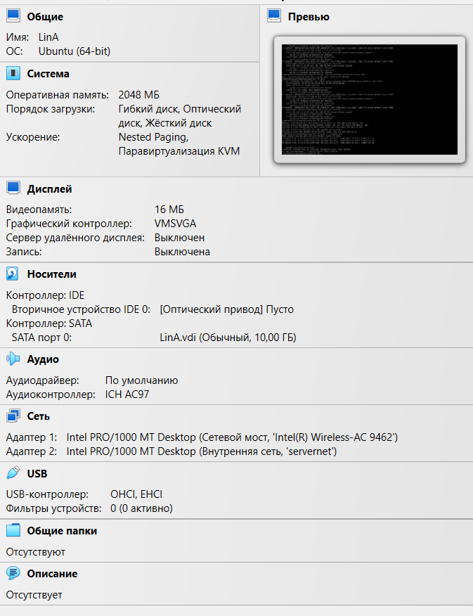

Был изменен hostname на `ismukhanova_server`.
Был создан пользователь `ismukhanova_1` с правами sudo.

Сетевые адаптеры в VirtualBox для Linux-A были настроены следующим образом:
- Адаптер 1: Сетевой мост (для доступа с хоста и в интернет).
- Адаптер 2: Внутренняя сеть с именем `servernet`.

Конфигурация сети была выполнена с помощью Netplan. Содержимое файла /etc/netplan/00-installer-config.yaml для Linux-A находится в папке configs (00-installer-config.yaml).

Результат применения конфигурации Netplan:
Вывод ip a на Linux-A:
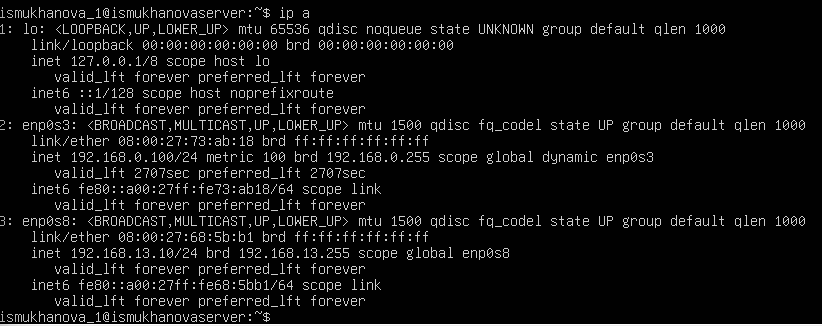

Вывод ip route на Linux-A:
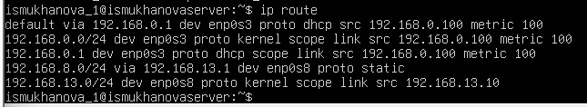

### Настройка SSH-доступа по ключу
На хост-компьютере Windows был сгенерирован SSH-ключ. Открытый ключ был успешно скопирован на Linux-A, что позволило осуществлять подключение по SSH без пароля.

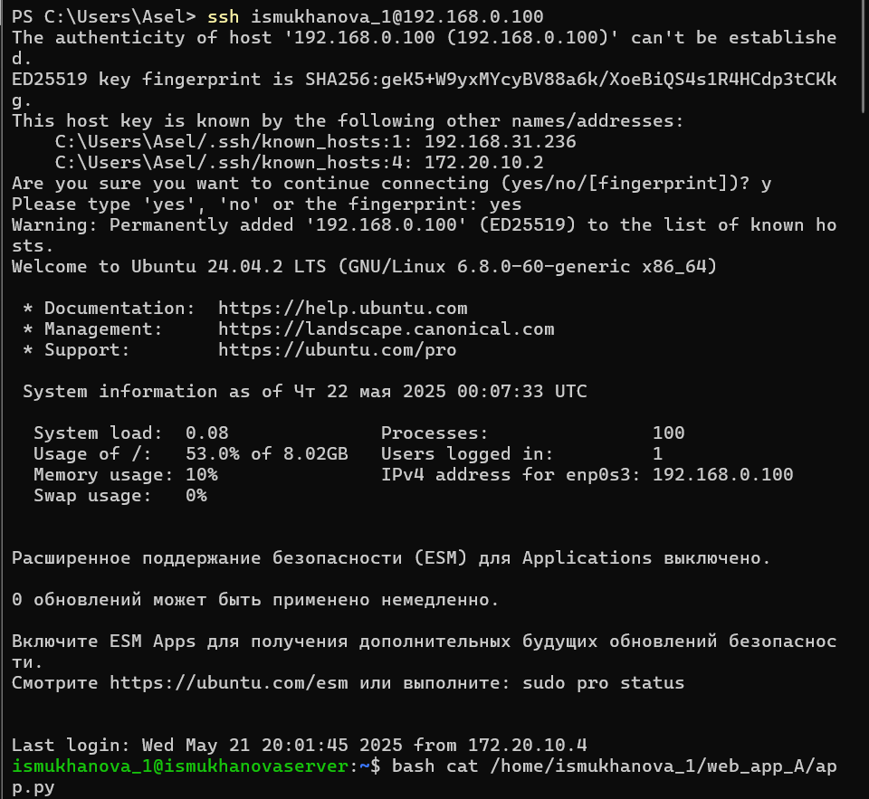

### Развертывание HTTP-сервера (Flask)

На Linux-A были установлены python3-pip и Flask. Был создан скрипт app.py (см. папку application/app.py), реализующий веб-сервер с тремя эндпоинтами.
Для автоматического запуска веб-сервера был создан systemd сервис. Конфигурация сервиса находится в файле configs/LinuxA/web-server-A.service.

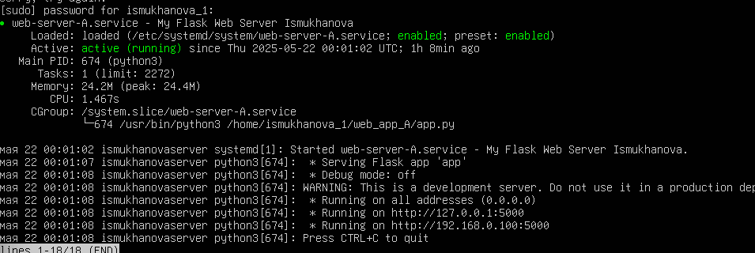

## Этап 2: Настройка Linux-B (ismukhanova_gateway)

Виртуальная машина Linux-B была создана путем клонирования Linux-A. Был изменен hostname на ismukhanova_gateway и создан пользователь ismukhanova_2 с правами sudo. Ненужный веб-сервис, унаследованный от Linux-A, был остановлен и отключен.

Сетевые адаптеры в VirtualBox для Linux-B были настроены для выполнения функций шлюза:
Адаптер 1: Сетевой мост.
Адаптер 2: Внутренняя сеть servernet (для связи с Linux-A).
Адаптер 3: Внутренняя сеть clientnet (для связи с Linux-C).

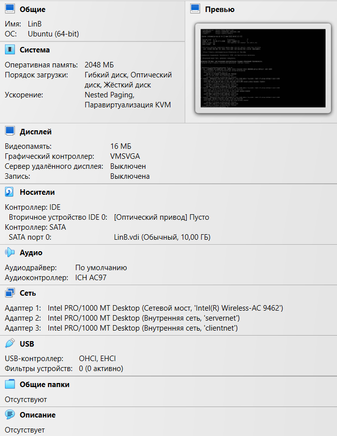

Конфигурация сети была выполнена с помощью Netplan. Содержимое файла /etc/netplan/00-installer-config.yaml для Linux-B находится в папке configs (00-installer-config.yaml).

Результат применения конфигурации Netplan:
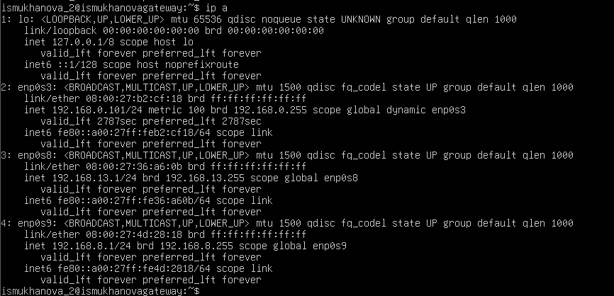

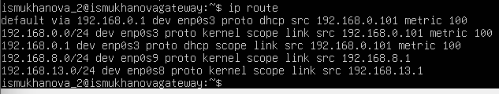

### Настройка IP Forwarding

Для обеспечения возможности пересылки пакетов между сетями на Linux-B был включен IP Forwarding. Изменения были внесены в /etc/sysctl.conf для сохранения настройки после перезагрузки.

### Настройка iptables

Для управления трафиком между сетями servernet и clientnet были настроены правила iptables. Политика по умолчанию для цепочки FORWARD была установлена в DROP. Были добавлены правила для разрешения установленных и связанных соединений, а также для разрешения новых TCP-соединений с Linux-C на Linux-A только по порту 5000. Конфигурация правил iptables сохранена в файле configs/LinuxB/linux_b_iptables.rules.

## Этап 3: Настройка Linux-C (ismukhanova_client)

Виртуальная машина Linux-C была создана путем клонирования Linux-A. Был изменен hostname на ismukhanova_client и создан пользователь ismukhanova_3 с правами sudo.
Сетевые адаптеры в VirtualBox для Linux-C:
Адаптер 1: Сетевой мост.
Адаптер 2: Внутренняя сеть clientnet (для связи с Linux-B).

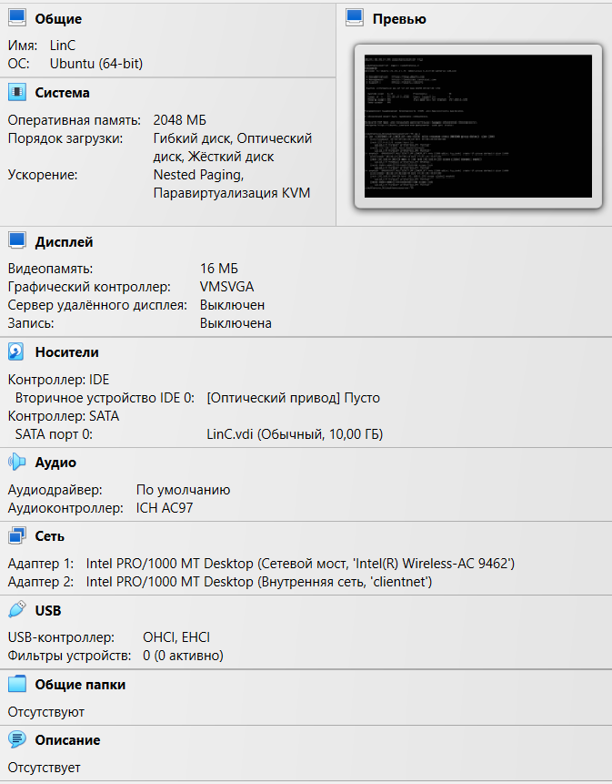

Конфигурация сети была выполнена с помощью Netplan, включая явное указание маршрута к сети Linux-A (192.168.13.0/24) через шлюз Linux-B (192.168.8.1). Содержимое файла /etc/netplan/00-installer-config.yaml для Linux-C находится в папке configs (00-installer-config.yaml).

Результат применения конфигурации Netplan:

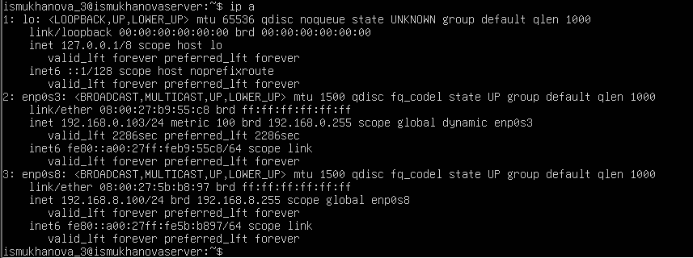
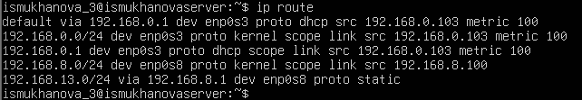

## Этап 4: Тестирование взаимодействия

Для отслеживания трафика на Linux-B была запущена команда sudo tcpdump -i any port 5000 -n -vv.

GET-запрос:
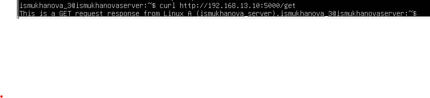

POST-запрос:

PUT-запрос:

### Проверка блокировки другого трафика
Попытка ping с Linux-C на Linux-A (192.168.13.10):
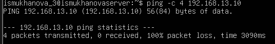

Пинг не проходит, так как правила iptables на Linux-B разрешают только TCP трафик на порт 5000 в цепочке FORWARD между данными сетями.

Попытка ssh с Linux-C на Linux-A (192.168.13.10):
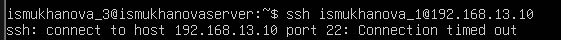
SSH-соединение не устанавливается, так как порт 22 не разрешен правилами iptables на Linux-B для пересылки.

### Проверка сохранения настроек после перезагрузки

Все три виртуальные машины были перезагружены (sudo reboot). После перезагрузки были выполнены следующие проверки:
IP Forwarding на Linux B активен (cat /proc/sys/net/ipv4/ip_forward показал 1).
Правила iptables на Linux B загружены (sudo iptables -L FORWARD -v -n показал настроенные правила).
Веб-сервер на Linux A запущен (systemctl status web-server.service показал active (running)).
Тестовый запрос curl http://192.168.13.10:5000/get с Linux C на Linux A прошел успешно.

## Заключение
В ходе выполнения лабораторной работы были успешно развернуты и настроены три виртуальные машины Linux. Настроено сетевое взаимодействие согласно схеме: обеспечена связь между клиентом (Linux-C) и сервером (Linux-A) через шлюз (Linux-B). На шлюзе настроена фильтрация трафика с помощью iptables, разрешающая только HTTP-запросы на порт 5000 к серверу. Веб-сервер на Flask был успешно развернут и протестирован. Все выполненные конфигурации сохраняются после перезагрузки системы, что подтверждает их корректное применение.
